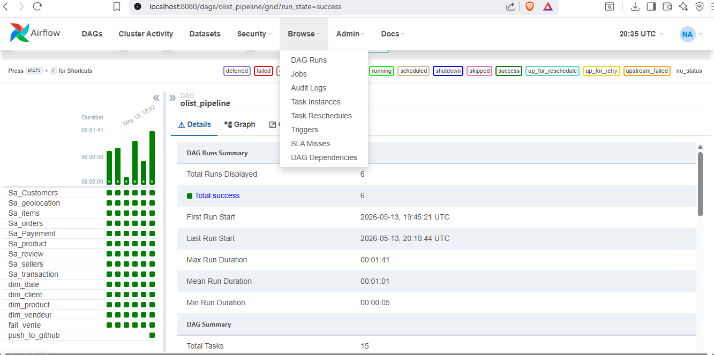

# 🛒 Brazilian E-Commerce Data Warehouse
### ETL Pipeline · Dimensional Modeling · Airflow Orchestration · Docker


---

## 📋 Project overview

End-to-end data warehouse built on the **Olist Brazilian E-Commerce** dataset
(Kaggle, 100k+ orders). The pipeline ingests raw CSV files, transforms them
into a clean star schema, loads into PostgreSQL, and is fully orchestrated
by Apache Airflow running in Docker.

---

## 🏗️ Architecture

```
[CSV Source Files]
        ↓
[Staging Area — 9 raw tables]
        ↓  Talend ETL Jobs (tMap · tUniqRow · tDBOutput)
        ↓
[Data Warehouse — Star Schema]
  ├── DIM_CLIENT    (customer_id, ville_etat, region_geo)
  ├── DIM_PRODUIT   (product_id, categorie, dimensions, poids)
  ├── DIM_VENDEUR   (seller_id, ville_etat, code_postal)
  ├── DIM_DATE      (date_commande, jour, mois, trimestre, annee)
  └── FAIT_VENTES   (sk_commande, montant_total, nb_articles, frais_livraison)
        ↓
[Apache Airflow DAG — 14 tasks orchestrated daily]
        ↓
[Power BI Dashboard — 4 pages analytics]
```

---

## ⚙️ Orchestration — Apache Airflow + Docker

### DAG Flow (14 tasks — ✅ All success)

```
Sa_Customers ─┐
Sa_geolocation─┤
Sa_items ──────┤
Sa_orders ─────┼──► dim_date ──► dim_client ──► dim_product ──► dim_vendeur ──► fait_vente
Sa_Payement ───┤
Sa_product ────┤
Sa_review ─────┤
Sa_sellers ────┤
Sa_transaction─┘
```

### Airflow DAG — 14 tasks success


### Run the project locally
```bash
git clone https://github.com/Nidhal398/brazilian-ecommerce-dwh.git
cd brazilian-ecommerce-dwh
cp .env.example .env        # fill in your GitHub token
docker-compose up -d --build
# Airflow UI: http://localhost:8080  (admin / admin)
```

---

## 🔧 Tech stack

| Layer | Tool |
|---|---|
| ETL / Integration | Talend Open Studio 8.0 |
| Data Warehouse | PostgreSQL 15 |
| Orchestration | Apache Airflow 2.7 |
| Containerisation | Docker + docker-compose |
| Visualisation | Power BI Desktop |
| Modelling | Star schema — Kimball methodology |
| Source data | Olist Brazilian E-Commerce — Kaggle |

---

## 📁 Repository structure

```
├── dags/
│   └── olist_pipeline.py     # Airflow DAG — 14 tasks
├── talend/
│   └── jobs/                 # Exported Talend job designs
├── sql/
│   ├── create_tables.sql     # DDL — staging + DWH
│   └── analysis.sql          # Analytical SQL queries
├── screenshots/              # Pipeline & dashboard screenshots
├── docker-compose.yml        # Full stack: PostgreSQL + Airflow
├── Dockerfile                # Custom Airflow image with Java
└── README.md
```

---

## 🚀 ETL jobs

| Job | Description |
|---|---|
| `Sa_Customers` | Loads raw customers → staging |
| `Sa_orders` | Loads raw orders → staging |
| `Sa_items` | Loads raw order items → staging |
| `Sa_sellers` | Loads raw sellers → staging |
| `Sa_product` | Loads raw products → staging |
| `Sa_geolocation` | Loads geolocation data → staging |
| `Sa_Payement` | Loads payment data → staging |
| `Sa_review` | Loads reviews → staging |
| `Sa_transaction` | Loads transactions → staging |
| `dim_client` | Deduplicates customers → DIM_CLIENT |
| `dim_produit` | Transforms products → DIM_PRODUIT |
| `dim_vendeur` | Loads sellers → DIM_VENDEUR |
| `dim_date` | Generates date dimension → DIM_DATE |
| `fait_vente` | Resolves surrogate keys → FAIT_VENTES |

---

## 📊 Sample analytics (SQL)

```sql
-- Top 5 product categories by revenue
SELECT p.categorie,
       ROUND(SUM(f.montant_total)::numeric, 2) AS total_revenue,
       COUNT(f.sk_commande)                    AS nb_orders
FROM   fait_ventes f
JOIN   dim_produit p ON f.fk_produit = p.sk_produit
GROUP  BY p.categorie
ORDER  BY total_revenue DESC
LIMIT  5;

-- Monthly revenue trend
SELECT d.annee, d.mois,
       ROUND(SUM(f.montant_total)::numeric, 2) AS revenue
FROM   fait_ventes f
JOIN   dim_date d ON f.fk_date = d.sk_date
GROUP  BY d.annee, d.mois
ORDER  BY d.annee, d.mois;
```

---

## 📸 Screenshots

### Star schema (Data Warehouse)


### Master job — DWH orchestration (Talend)


### Master job — Staging area (Talend)


### Fact table ETL


### Dimension jobs


---

## 📊 Power BI Dashboard

4-page interactive dashboard built on top of the DWH:

- **Page 1** — KPIs: Total Revenue (R$20M), Orders (113K), Avg Order Value
- **Page 2** — Geographic distribution across Brazilian states
- **Page 3** — Product categories analysis (bar chart + treemap)
- **Page 4** — Sellers performance by state


---

## 📂 Dataset

[Olist Brazilian E-Commerce — Kaggle](https://www.kaggle.com/datasets/olistbr/brazilian-ecommerce)

---

*Built as a Data Engineering portfolio project — M1 student*
