# 🛒 Brazilian E-Commerce Data Warehouse
### ETL Pipeline · Dimensional Modeling · SQL Analytics


---

## 📋 Project overview

End-to-end data warehouse built on the **Olist Brazilian E-Commerce** dataset (Kaggle, 100k+ orders).
The pipeline ingests raw CSV files, transforms them into a clean star schema, and loads the result
into PostgreSQL for analytical querying.

---

## 🏗️ Architecture

```
[CSV Source Files]
        ↓
[Staging Area — raw tables]
        ↓  Talend ETL Jobs (tMap · tUniqRow · tDBOutput)
        ↓
[Data Warehouse — Star Schema]
  ├── DIM_CLIENT    (customer_id, ville_etat, region_geo)
  ├── DIM_PRODUIT   (product_id, categorie, dimensions, poids)
  ├── DIM_VENDEUR   (seller_id, ville_etat, code_postal)
  ├── DIM_DATE      (date_commande, jour, mois, trimestre, annee)
  └── FAIT_VENTES   (sk_commande, montant_total, nb_articles, frais_livraison)
```

---
## 📸 Screenshots

### Star schema
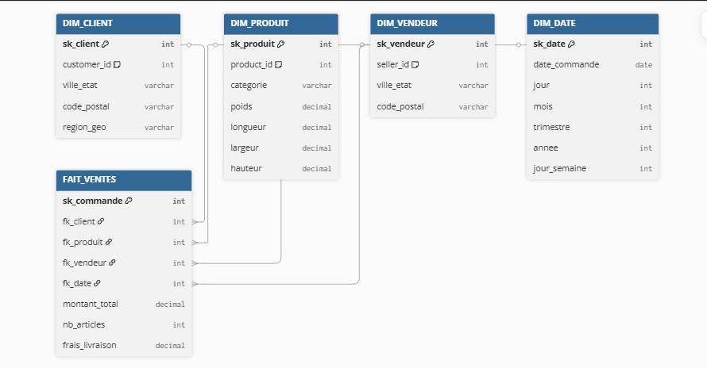

### Master job — DWH orchestration
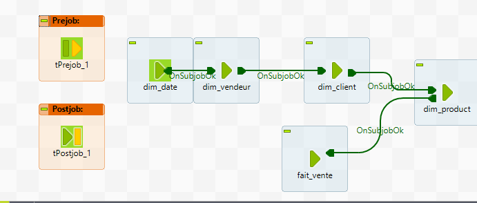

### Master job — Staging area
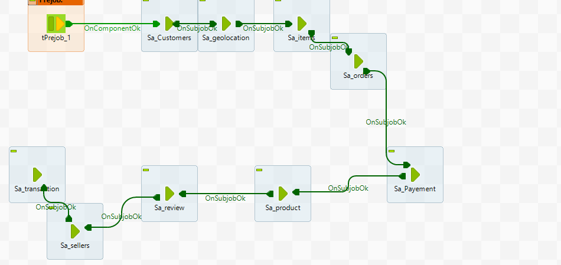

### Fact table ETL (fait_ventes)
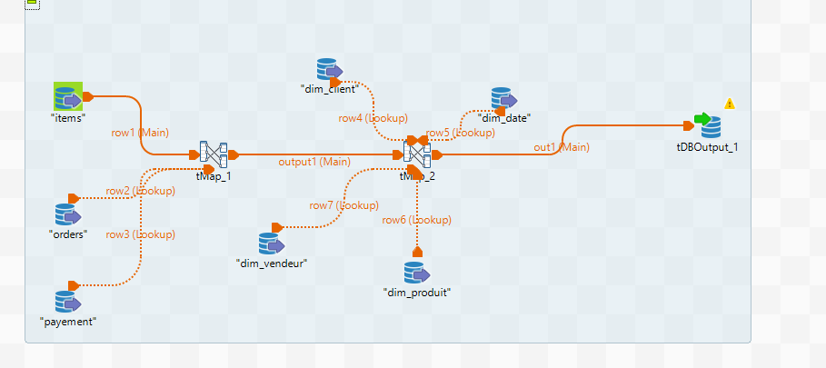

### Dimension jobs
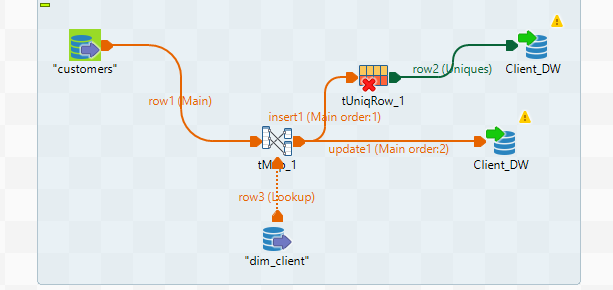
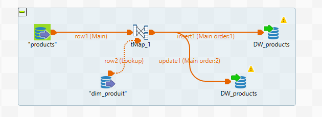
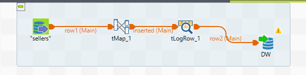
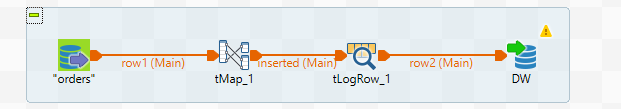
---

## 🔧 Tech stack

| Layer | Tool |
|---|---|
| ETL / Integration | Talend Open Studio 8.0 |
| Data Warehouse | PostgreSQL 15 |
| Modeling | Star schema (Kimball methodology) |
| Source data | Olist Brazilian E-Commerce — Kaggle |

---

## 📁 Repository structure

```
├── talend/          # Exported Talend job designs (.item files)
├── sql/
│   ├── ddl/         # CREATE TABLE scripts (staging + DWH)
│   └── analysis/    # Analytical SQL queries
├── screenshots/     # Talend job screenshots, schema diagram
└── README.md
```

---

## 🚀 ETL jobs

| Job | Description |
|---|---|
| `dim_client 0.1` | Loads & deduplicates customers → DIM_CLIENT |
| `dim_produit 0.1` | Transforms product catalog → DIM_PRODUIT |
| `dim_vendeur 0.1` | Loads seller data → DIM_VENDEUR |
| `dim_date 0.1` | Generates date dimension → DIM_DATE |
| `fait_vente 0.1` | Resolves surrogate keys, loads fact table |
| `master_job_dwh 0.1` | Orchestrates full DWH load |
| `master_job_SA 0.1` | Orchestrates staging area load |

---

## 📊 Sample analytics (SQL)

```sql
-- Top 5 product categories by revenue
SELECT p.categorie,
       ROUND(SUM(f.montant_total)::numeric, 2) AS total_revenue,
       COUNT(f.sk_commande)                    AS nb_orders
FROM   fait_ventes f
JOIN   dim_produit p ON f.fk_produit = p.sk_produit
GROUP  BY p.categorie
ORDER  BY total_revenue DESC
LIMIT  5;
```

---
## 📊 Power BI Dashboard

4-page interactive dashboard built on top of the DWH:

- **Page 1** — KPIs: Total Revenue (R$20M), Orders (113K), Avg Order Value
- **Page 2** — Geographic distribution across Brazilian states
- **Page 3** — Product categories analysis (bar chart + treemap)
- **Page 4** — Sellers performance by state

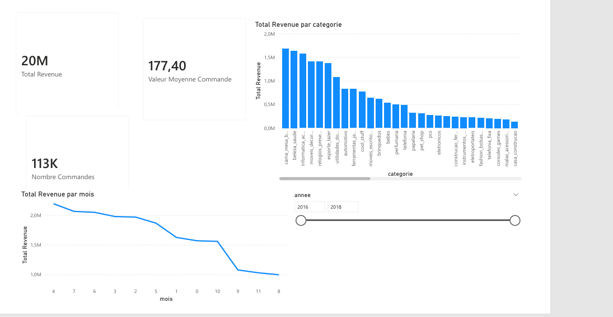
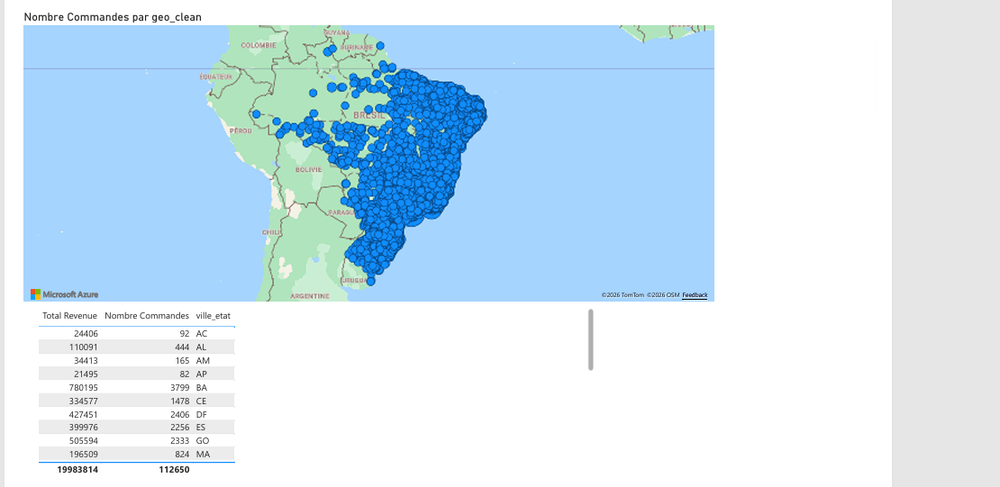
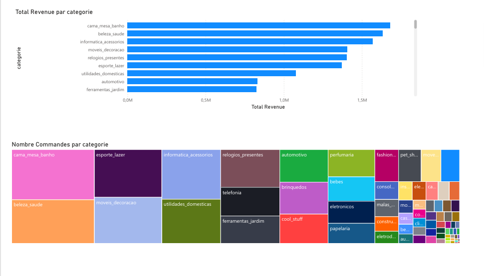
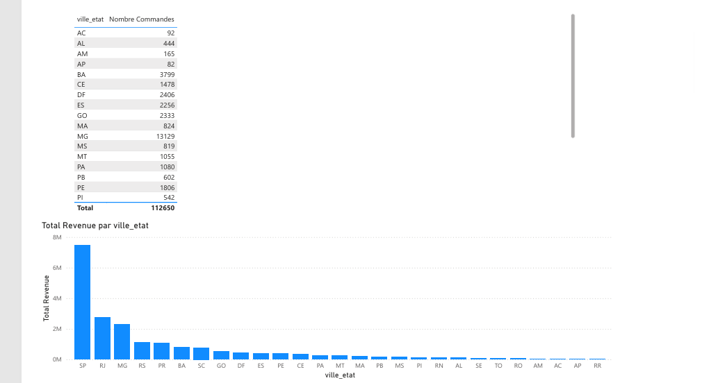
## 🗺️ What's next

- [ ] Airflow orchestration to replace master_job
- [ ] Docker-compose for reproducible local setup

---

## 📂 Dataset

[Olist Brazilian E-Commerce — Kaggle](https://www.kaggle.com/datasets/olistbr/brazilian-ecommerce)

---

*Built as a personal Data Engineering portfolio project.*
